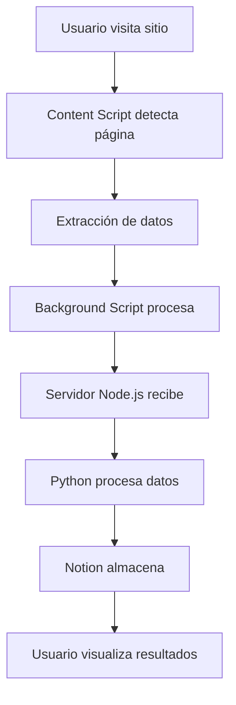

# 📋 Contexto del Proyecto - Bio Cattaleya Scraper v4.3

## 🎯 Objetivo Principal

Desarrollar una extensión de Chrome profesional para extracción automatizada de información de productos de sitios web de e-commerce, con capacidades avanzadas de procesamiento y almacenamiento de datos.

## 🏗️ Arquitectura del Sistema

### Componentes Principales

1. **Extensión Chrome**
   - `content.js`: Motor principal de extracción
   - `background.js`: Servicios en segundo plano
   - `popup.html/js`: Interfaz de usuario principal
   - `sidepanel.html`: Panel lateral extendido

2. **Backend Server**
   - `server/server.js`: API Node.js/Express
   - `server/routes/`: Endpoints especializados
   - `server/middleware/`: Autenticación y seguridad

3. **Procesamiento Python**
   - `receptor_biocattaleya.py`: Receptor principal
   - `receptor_biocattaleya_v2.py`: Versión mejorada

4. **Sistema de Debug**
   - `debug_server/`: Servidor de desarrollo
   - Sistema de logging completo

## 🔧 Tecnologías Utilizadas

### Frontend (Extensión)
- **JavaScript ES6+**: Lógica principal
- **HTML5/CSS3**: Interfaces de usuario
- **Chrome Extension API**: Integración con navegador
- **Webpack**: Build y optimización

### Backend
- **Node.js**: Runtime principal
- **Express.js**: Framework web
- **Python**: Procesamiento de datos
- **Chrome Runtime Messaging**: Comunicación

### Almacenamiento
- **Notion API**: Base de datos principal
- **Chrome Storage**: Configuración local
- **File System**: Logs y caché

## 🔄 Flujo de Datos



## 📊 Estructura de Datos

### Producto Extraído
```javascript
{
  title: "Título del producto",
  price: "$123.45",
  image: "url_imagen",
  url: "url_producto",
  source: "plataforma_origen",
  sku: "identificador_único",
  variants: [...],
  metadata: {...}
}
```

## 🎛️ Configuración

### Variables de Entorno
- `NOTION_API_KEY`: Autenticación Notion
- `NOTION_DATABASE_ID`: Base de datos destino
- `LICENSE_KEY`: Validación de licencia
- `DEBUG_LEVEL`: Nivel de logging

### Configuración de Extensión
- `BSC_DEBUG`: Modo desarrollo
- `EXTRACTION_INTERVAL`: Frecuencia de extracción
- `MAX_ITEMS_PER_PAGE`: Límite de productos

## 🔐 Consideraciones de Seguridad

### Autenticación
- Validación de licencia local
- Tokens de API seguros
- Encrypted communication

### Sanitización de Datos
- Limpieza de HTML
- Validación de inputs
- Escape de caracteres especiales

## 🐈‍⬛ Manejo de Errores

### Estrategia de Retry
- Exponential backoff
- Límite de intentos
- Fallback mechanisms

### Logging
- Niveles de debug
- Archivos rotativos
- Remote logging

## 📈 Métricas y Monitoreo

### KPIs Principales
- Items extraídos por minuto
- Tasa de éxito de extracción
- Tiempo de respuesta
- Errores por plataforma

### Dashboard
- Estado del sistema
- Extracciones en tiempo real
- Historial de errores

## 🔄 Versionado y Cambios

### v4.3 - Actual
- Mejoras en mutation observer
- Optimización de memoria
- Nuevas plataformas soportadas

### Cambios Recientes
- Refactor de content.js
- Mejoras en seguridad
- Nuevo sistema de logging

## 🚀 Roadmap

### Próximas Versiones
- v4.4: Machine learning para clasificación
- v4.5: Soporte móvil
- v5.0: Arquitectura microservicios

## 📚 Documentación Relacionada

- `../SECURITY_*.md`: Guías de seguridad
- `../bug-registry/`: Registro de problemas
- `../../README.md`: Guía general

---

**Última actualización**: v4.3 - Abril 2026  
**Mantenedor**: Equipo Bio Cattaleya
